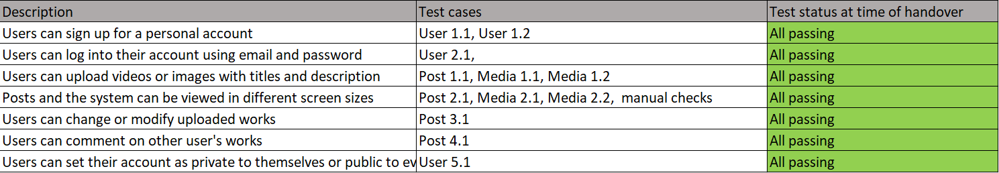

# Efolio Documentation:

## Table of Contents

- [Introduction](#introduction)
  - [Motivation](#motivation-for-e-folio)
  - [Demo](#demo)
- [Features](#features-implemented)
- [Set Up](#set-up)
  - [Installing Packages](#installing-packages)
  - [Creating MongoDB Database](#creating-mongodb-database)
  - [Creating AWS S3 Bucket](#creating-aws-s3-bucket)
  - [Backend .env Files](#backend-.env-files)
  - [GitHub Actions Continuous Integration](#github-actions-continuous-integration)
- [System Requirements](#system-requirements)
- [Running](#running)
  - [Deployment Backend Server](#deployment-backend-server)
  - [Development Frontend Server](#development-frontend-server)
  - [Backend Testing](#backend-testing)
  - [Code Linting](#code-linting)
- [Deployment](#deployment)
  - [Local Deployment](#local-deployment)
  - [Remote Deployment](#remote-deployment)
  - [Heroku Deployment](#heroku-deployment)
- [Costs and licencing Considerations](#costs-and-licencing-considerations)
- [Database](#database)
- [Frontend Architecture](#frontend-architecture)
- [Backend Architecture](#backend-architecture)
  - [General Design](#general-design)
  - [User Authentication](#user-authentication)
  - [Media API](#media-apimedia)
  - [Users API](#users-apiuser)
  - [Posts API](#posts-apipost)
  - [Comments API](#comments-apicomment)
- [Style Guide](#style-guide)
  - [Code Style](#code-style)
  - [Console Logs](#console-logs)
  - [API Responses](#api-responses)
- [Test Cases](#Test-Cases)

## Introduction

E-folio is a digital portfolio system designed to allow students and creators to display their work.
Users can upload posts containing media and text, browse the works of others, and interact with other works through comments and likes.

The system has been designed with a focus on students, but would be useful for anyone hoping to display their work online as part of a digital portfolio.
A student, for example, could regularlly post reflective reports to be viewed and assessed by their mentors and peers. Similarly, an artist or musician could use the folio to display their work.

Our stack is javascript heavy - our backend is written using node.js with express middleware, and our frontend is built with react.js and Material UI.
For data and file storage, we use a mongoDB database and an AWS S3 bucket.

### Motivation for E-FOLIO

Our conception of E-folio was motivated by the idea that the platform should be a simple platform that could be used by anyone who wanted
to showcase their work, with a primary focus on the academic arena.

Detailed design documents relating to our core vision of the e-folio system can be found in the [/docs directory](/docs). We have provided a description of these documents below.

#### Personas

A range of personas have been constructed to help us identify user needs, behaviours, goals and experiences. They include:

- The undergraduate student
- The post graduate student
- The lecturer
- The industry representatives.

#### Motivational Model

A motivational model was used to help determine the key requirements of the system. Our motivational model was created after a DO-BE-FEEL
questioning session with the clients.


#### User stories

We have derived a series of user stories from our personas and motivational model in order to help define the core features of our project. These include
general user stories for classes of users and specific user stories that answer the needs of individual users.

## Demo

A hosted demo of the project can be found [here](https://efolio.herokuapp.com/).

We have provided a demo account so that you can see a fully fleshed out account. However, feel free to create new user accounts and posts.

Demo credentials

- Email: johnsmith1@gmail.com
- Password: demo1234

## Features implemented

We provide a brief outline of the key features of our system.

- Account creation: Users can create their own accounts. A user’s account allows them to display their professional fields, biography, and contact details, allowing them to easily connect with other users. An account also allows the user to participate in the community by creating posts and comments.

- Account editing: Users can update their account details, allowing them to change their biographical details, profile picture, privacy settings, display name, and areas of professional interest.

- File upload / media support: Users can upload a variety of files, including images, videos, pdf files, spreadsheets, and word documents. By providing users with the ability to upload a wide variety of media, users gain the ability to create a portfolio that closely reflects their skills and body of work.

- Post creation: Users can create posts containing media, a title, and a description. Posts can be tagged with specific topics by users to focus conversation and to improve their visibility to other users.

- Post editing: Posts can be edited after creation, allowing users to correct mistakes in their portfolio. Additionally, posts can have their privacy settings modified, allowing users to hide posts that they feel have attracted unwanted attention, or to show their previously private posts to the world.

- Search bar: We have added search functionality to our site so that users can find content and people that match their interests. Searching can be performed using the search bar in the header.
  - Posts can be searched and filtered based on their title, tags, and description.
  - Users can be searched based on their username and professional fields.
- Post feed: When viewing a user’s profile, a feed of their posts is visible. The feed supports infinite scrolling and will dynamically fetch new posts as the viewer scrolls.
  - Post filtering: A filter can be applied to the posts that appear in a user’s profile feed, allowing viewers to search for posts from the user that contain specific words or tags.
- Pinned post bar: We have implemented a “pinned-post” carousel that allows a user to draw attention to posts they feel are significant. Posts selected by the user are placed in a carousel that sits at the top of their profile, allowing them to shape the first impression they give to page visitors.

- Commenting: Users can create comments on posts, allowing them to give feedback and encouragement to other students, professionals, and creators.

- Post liking: Users can like comments and posts. This ability to interact with the work of other users helps to build a sense of community on the site, and receiving likes gives the creator of a liked post or comment a sense of validation.

- Dynamic header: To allow users to quickly navigate around our site, we have added a header to all our pages. The header displays navigation links, a search bar, and either the user’s profile details or the login/signup buttons depending on if the user is logged in. On smaller screens, some nav links from the header are moved to a dropdown.

- Dynamic profile card: On a user’s profile page, their name, interests, bio, contact information, and photograph are displayed in a card format. This prominent summary of the user makes it simple for recruiters and other users to get a measure of someone from their profile. When viewing a profile page on devices with smaller screen sizes, the profile card is initially hidden and can be slid out from the left of the screen.

## Set Up

#### Installing Packages

To install the required Node.js packages, run the command `npm install` in both the root directory and in the `/client` directory of this repository. In order to use npm, ensure Node.js is installed.

#### Creating MongoDB Database

Our system uses a MongoDB to store and retreive data. These instructions are for using MongoDB's cloud hosted database. However, a locally hosted MongoDB server can be used [instead](https://docs.mongodb.com/manual/tutorial/install-mongodb-on-windows/).

To create a database to use with Efolio, first make an account and create a cluster with their [website](https://www.mongodb.com/). The currently deployed version of Efolio uses the free tier of MongoDB.

Once the cluster has been made, navigate to "Network Access" under "Security" on the right side menu. Within this tab, the IP address of Efolio server can be whitelisted to allow the backend server to access the MongoDB database. An IP address of 0.0.0.0 can also be added to whitelist all IP addresses.

<p align="center">
  
</p>

Next, navigate to the "Database Access" tab and create a new database user. Ensure the authentication method is password and the user is given both read and write privileges. The username and password created here will be used by the backend server to access the MongoDB database.

<p align="center">
  
</p>

#### Creating AWS S3 Bucket

Efolio uses an AWS S3 Bucket to store user's uploaded files, such as images, videos and other documents. In the currently deployed version, a free S3 Bucket is used with limited monthly requests.

To create an AWS S3 Bucket, first create an AWS account [here](https://portal.aws.amazon.com/billing/signup?nc2=h_ct&src=default&redirect_url=https%3A%2F%2Faws.amazon.com%2Fregistration-confirmation#/start). Next navigate to the service called "S3". This can be done by simply searching for "S3" in the Find Services search box.

 <p align="center">
  
</p>

Select the orange "Create bucket" icon and create the S3 bucket. Ensure the Bucket name is recorded as it will be later. Do not change any other settings for the S3 Bucket.

 <p align="center">
  
</p>

Finally, navigate to your username at the top right and select "My Security Credentials" from the drop down menu. Open the "Access keys (access key ID and secret access key)" menu and pree the "Create New Access Key" icon. Record the newly created Access Key ID and Secret Key.

 <p align="center">
  
</p>

#### Backend .env Files

The backend server requires the two `.env` files `.env.development` and `.env.test` to be created at the root of the repository in order for the development and testing environments to function.
The `.env` files should include the listed variables with the correct values for each.

```dotenv
PORT = <portForBackEndServer>
MONGO_USERNAME = <userNameForMongoDBConnection>
MONGO_PASSWORD = <passwordForMongoDBConnection>
DB_NAME = <nameOfDataBase>
SECRET = <secretUsedToCreateAuthTokens>
AWS_ACCESS_KEY_ID = <accessKeyForAWSBucket>
AWS_SECRET_ACCESS_KEY = <secretAcessKeyForAWSBucket>
AWS_BUCKET_NAME = <AWSBucketName>
```

Attributes:

- <b>\<portForBackEndServer></b> should the port which the backend server should run on.
- <b>\<userNameForMongoDBConnection></b> should be the username of the created mongoDB user made earlier.
- <b>\<passwordForMongoDBConnection></b> should be the password of the created mongoDB user made earlier.
- <b>\<nameOfDataBase></b> should be a name for the MongoDB Collection used by the backend server. For initial set up, any server name can be chosen as a new Collection will made if supplied name does not exist. The Collection name should differ between the two `.env` files `.env.development` and `.env.test`to ensure the tests are not run on the development Collection.
- <b>\<secretUsedToCreateAuthTokens></b> Should be a long random string with which access tokens can be securely generated from. The secret currently used in deployment is 138 characters long.
- <b>\<accessKeyForAWSBucket></b> Should be the Access Key ID created earlier when setting up the AWS S3 Bucket.
- <b>\<secretAcessKeyForAWSBucket></b> Should be the Secret Key created earlier when setting up the AWS S3 Bucket.
- <b>\<AWSBucketName></b> Should be the Bucket name created earlier when setting up the AWS S3 Bucket.

#### Setting up CI with GitHub Actions

Continuous integration testing allows our code to be automatically tested whenever a new pull request to the Master branch is made.
We have chosen to use the Jest testing package for our integration tests.

In order to set up continuous integration testing, you must copy the attributes from the `.env.test` file into the GitHub secrets section of your repository.
To access secrets, navigate to repository settings and click on the "Secrets" tab. Make sure that you enter the key value pairs exactly as they appear in `.env.test`.

 <p align="center">
  
</p>

If you would like to customise the CI testing, our GitHub Actions workflow can be found within the `.github` directory.

## System Requirements

This system requires:

- Mongo DB server
  - can be hosted locally or on the cloud
- Node.js
  - version 12.x^
  - key packages used
    - Express
    - Mongoose
    - Jest
    - React
    - Material UI
- AWS S3 Bucket

## Running

#### Development Backend Server

To run the backend server in development mode, run the command `node server.js` with the environmental variable "NODE_ENV" set to "development". This can be done on Linux with the command `NODE_ENV=development node ./server.js`. To do this Windows, run either `SET NODE_ENV=development&node server.js` or the script `npm run start`. These commands should be run within the root directory of the repository.

#### Development Frontend Server

To run a server for frontend development, run the command `react-scripts start` or the script `npm run start` in the `/client` directory of the repository. The front end server will automatically request to the backend server for a simple development process.

#### Backend Testing

To run the tests for the backend code, run the command `npm run test` in the root directory of the repository. This will run all of the integration tests created for the backend and display which tests succeed and which failed. These tests are run on the test MongoDB collection as it uses the `.env.test` file created earlier. To ensure no race conditions affect testing, do not run multiple tests at the same time, including the GitHub continuous integration testing.

#### Code Linting

Eslint was used in the creation of Efolio, and ensure consistency within the code. To run Eslint on the project, run the command `npm run lint` in the root directory of the repository.

## Deployment

Efolio is current deployed with Heroku [here](https://efolio.herokuapp.com/). Deployment can be done locally or using a hosting service such as Heroku.

#### Local Deployment

To deploy locally, run the command `npm run build` in the `/client` directory to create a build of the frontend. Next run the backend server with the the environmental variable "NODE_ENV" set to "production" as well as the other environmental variable specified in the `.env` files. Ensure this is done the in root of the repository.

Demo Commands:

- For Linux: - `NODE_ENV=production PORT=<port> MONGO_USERNAME=<username> MONGO_USERNAME=<password> DB_NAME=<dbname> SECRET=<secret> AWS_ACCESS_KEY_ID=<accesskey> AWS_SECRET_ACCESS_KEY=<secretkey> AWS_BUCKET_NAME=<bucketname> node ./server.js`
- For Windows: - `SET "NODE_ENV=production" & SET "PORT=<port>" & SET "MONGO_USERNAME=<username>" & SET "MONGO_USERNAME=<password>" & SET "DB_NAME=<dbname>" & SET "SECRET=<secret>" & SET "AWS_ACCESS_KEY_ID=<accesskey>" & SET "AWS_SECRET_ACCESS_KEY=<secretkey>" & SET "AWS_BUCKET_NAME=<bucketname>" & node ./server.js`

#### Remote Deployment

The process for remote deployment is same as local deployment. Repeat the above process on the chosen remote hosting solution. The rest of this guide will focus on deployment on Heroku, which the project was streamlined for.

#### Heroku Deployment

Create an Heroku account [here](https://www.heroku.com/) and create a new app. Within the app, select the "Deploy" tab and choose "GitHub" under "Deployment Method" and connect the repository to the app. Alternate deployment methods can be used as well.

 <p align="center">
  
</p>

Navigate to the "Settings" tab and select the "Reveal Config Vars" icon. Within here, add the key value pairs specified in the `.env` files to the Heroku app. Ensure the key value pair: `NODE_ENV` and `production` is also included.

 <p align="center">
  
</p>

Navigate back to the "Deploy" tab and select the branch to be deployed under "Manual Deploy" and select "Deploy Branch". Automatic deploys can be also be enabled if desired. This should deploy the Efolio project to the link `<appname>.herokuapp.com`. The creation of the build of the frontend is handled by the script `heroku-postbuild` which can be found in the file `./package.json`.

## Costs and licencing considerations

- Our system makes use of PDFTRON's node.js PDF libraries. To use these libraries commercially, a licencing fee must be paid.
  A licence can be obtained [here](https://www.pdftron.com/licensing/).

- Our system is currently using the free-tier of AWS. Once in production, the system will need to be linked to a new amazon account and S3 bucket, and relevant usage fees will need to be paid.
  Pricing information can be found [here](https://aws.amazon.com/pricing/).

- Our system currently makes use of a cloud hosted mongoDB server. If an externally hosted server will also be used in production, usage fees will apply.
  Pricing information can be found [here](https://www.mongodb.com/pricing).

## Architecture Diagram

We have provided an architecture diagram to outline the connections between different layers of our system. These layers will be explored in greater depth in the subsequent sections of the readme.


## Database

#### Database description

Our system uses a MongoDB database to store account data, comments, media file metadata, and posts created by users.
File storage for uploaded media is not handled by our database – instead, the files are stored in an AWS S3 bucket and their key stored in our database.

Key fields have basic validation on length and content, and custom validation is used to ensure that emails used by accounts have a valid format. Additionally, all database documents store timestamps for the document creation and the document's most recent update.

#### Selection rationale

We selected MongoDB as our database for two main reasons:

- The schemaless nature of the database allowed us to quickly iterate on our design and add or remove features
- Our team was familiar with mongoDB and had previously used it to build other systems

#### Document description

We provide an explanation of the main documents used in our database below:

##### Media

The media document type is used to store media metadata. The ID of the media file is used as a key for the media content stored in our S3 bucket. Files must be less than 15mb.

The document stores:

- mimeType: The MIME-type and extension of the file
- isPrivate: The privacy of the media
- givenFileName: The name of the media

The document also stores the following references:

- creator: The ID of the <b>User</b> who uploaded the media file

##### Posts

The post document is used to represent the user-produced content that our e-folio system displays.

The document stores:

- title: The title of the post
- description: The description of the post (optional)
- private: The privacy of the post
- isUserPrivate: The privacy of the user who made the post
- tags: An array of tags which posts can be searched by
- comments: An array of <b>Comment</b> documents representing the comments made on a post

The document also stores the following references:

- mediaID: The ID of the <b>Media</b> document for the post content
- thumbnailURL: The ID of the <b>Media</b> document for the post thumbnail (optional)
- userID: The ID of the <b>User</b> who created the post

##### User

The user document represents the users of our website.

The document stores:

- email: The email address of the user which is used to log into the user's account
- firstName: The first name of the user
- lastName: The last name of the user
- UserName: The username of the user
- pinnedPosts: An array of <b>Post</b> documents which are pinned by the user
- password: a hashed and salted version of the user's password
- organisation: The organisation of the user (optional)
- professionalFields: An array of fields which a user can be search by
- dateOfBirth: The date of birth of the user (optional)
- phoneNumber: The phone number of the user (optional)
- biography: A introduction or biography of the user (optional)
- private: The privacy of the user
- phoneNumberPrivate: The privacy of the user's phone number
- emailPrivate: The privacy of the user's email

The document also stores the following references:

- profilePic: The ID of a <b>Media</b> document that contains the profile picture of the user

##### Comment

The comment document is used to store data about comments made on user posts.

The document stores:

- comment: The comment body

The document also stores the following references

- likedBy: The IDs of the <b>Users</b> who have liked the post
- userID: The ID of the <b>User</b> who posted the comment

##### Diagram

We have provided a "crows-foot" diagram of the relations between documents used in our database. Note that the S3 bucket included in the diagram is <b>NOT</b> part of our database.


### CI/CD Pipeline

We have built a simple CI/CD pipeline to improve code quality and assist in the deployment of updates.
Tests triggered on merge requests to master must pass before code can be merged, and once merged, the updated master branch will be automatically deployed.
We provide a brief sketch of the role of the CI/CD pipeline in the development cycle below.

##### Development Lifecycle

1. Create feature branch
2. Write new code, test locally
3. Make pull request
4. <b>\[CI\]</b> Integration tests are automatically run using Github actions
   - If tests fail, the merge cannot be completed. Return to step 2
   - If tests pass, proceed to step 5
5. Review and approve merge, pull onto master
6. <b>\[CD\]</b> Merge onto master triggers an automatic deployment to Heroku using Github actions
7. Heroku will install relevant packages and start the server. The site is now deployed and reflects the latest changes from master

## Frontend Architecture

### Architecture Diagram

<p align="center">
  
</p>

Assets used in our front-end (eg. image missing thumbnails) are stored in the `/client/src/assets` directory. Source code for components is stored in the `client/src/components` directory.

#### Header

The website header is displayed on every page. Related files are stored in `/client/src/components/header` which contains:

- A header component

#### Home

The home page is shown after successful login or clicking on logo in the header. Related files are stored in `/client/src/components/header`, which contains:

- A welcome message component
- The home screen

#### Profile page

The user profile can be accessed through the search screen or by clicking on a link to the user's profile. Related files are stored in `/client/src/components/profile`, which contains:

- Components for the infinite scroll of posts
- Components for the display of pinned posts
- Components for the display of a user's profile details
- The profile page

#### Posts

Posts appear in the search screen, in a user's feed, and when a post is expanded. Related files are stored in `/client/src/components/Post`, which contains:

- Comment related components
  - A component for the create comment form
  - A component for displaying a list of comments
  - A component for individual comments
- A component for post previews
- Components for like buttons
- Components for the adding and edit post forms
- The expanded post view page

#### Login

The login page is used to log users in and give them new auth tokens. Related files are stored in `/client/src/components/login`, which contains:

- Components for the login form
- The login page

#### Signup

The signup page is used to create new user accounts. Related files are stored in `/client/src/components/signup`, which contains:

- Components and forms for different stages of the signup process
- The signup page

#### Search

The search screen is used to display search results. Related files are stored in `/client/src/components/search`, which contains:

- Components for helping carry out search logic
- The search results page

#### Settings

The settings form is used to update a user's account details and settings. Related files are stored in `/client/src/components/settings`, which contains:

- Components for different stages of the account update process
- The settings page

#### Utils

Our system makes use of utiliy functions to simply our media requests. Related files are stored in `/client/src/utils`, which contains:

- Utility functions for fetching media with and without tokens
- Utility functions for uploading media files

## Backend Architecture

### General Design

Our system's backend uses node.js with express middleware. The system is composed of the following key components:

- An index router that passes requests down to sub-routers. The router is located at `/routes/index.js`.
- Sub-routers that authenticate the user and call controller functions. These routers are located in `/routes`.
- A collection of controllers associated with comments, media, posts, and users. These controllers are located in `/controllers`.
- A collection of Mongoose models and basic database connection logic. Models and DB logic are located in `/models`.

The flow of control during the handling of a request is as follows:

1. Request is recieved at server.js
2. Request is passed to index router
3. Request is passed down to sub-router by index router
4. Authentication of user token occurs (optional)
5. Controller function is called by sub-router
6. Controller carries out request
7. Response is sent

We provide an in-depth review of our authentication process and controller functionality below.

### User Authentication

Our system uses bearer tokens to authenticate requests. To ensure the security of user accounts, we have given the tokens a 6 hour expiry timer, preventing them for being reused by bad actors who gain access to a user's computer or token.

For all requests made to routes that require authentication, our middleware extracts and validates the authorization token provided in the request. There are three possible outcomes to this validation.

- If the token is valid, user information is injected into the request before it is passed to our controllers.
  This user information can be accessed in a controller through `req.user`, which contains the user's id and other data.

- If the token is invalid or expired, the server will respond with status code 403 and the message `Forbidden`.

- If the token is not provided, the server will respond with status code 401 and the message `Unauthorized`

Note that some routes do not require authentication, for example those that handle the service of posts with public visibility.

### Media (`/api/media`)

The media route is used for all requests that deal with the uploading, fetching, updating, or deletion of media files. All requests to this route are handled by the controller located at `/controllers/media.js`.

#### Handling of Special File Types

Due to the limited support for web-display of microsoft `.docx`, `.xlsx`, and `.pptx` files, our media controller converts these files to `.pdf` form to allow them to be simply displayed in our frontend.

When a request is made to our `/api/media/add` route, the controller identifies microsoft file formats and converts them to `.pdf` form.
The converted files are stored in our s3 bucket, and our database stores metadata that reflects the details of the converted file.

#### Add Media

###### Creates a new media document in the database, saves the media blob to a s3 bucket, returns the media document id

Request to: `/api/media/add` as a `POST` request

Takes: an authorization header with the format

```
Authorization: "Bearer <authenticationToken>"
```

and HTML form data containing the following fields:

```
-isPrivate: "<privacyBoolean>",
-givenFileName: "<fileDisplayName>",
-mediafile: <mediablob>"
```

Requirements:

- Authorization header is required
- Authentication token must be a valid token
- file display name must be <= 2000 characters
- a privacy status must be provided
- a media file must be provided
- the media file must have a size <= 15 mb

Responses:

- On success:

  - the response will have a status code of "201" and will contain the media metadata
  - ```JSON
    {
       "_id": "<mediaID>",
       "mimeType": "<mimeType>",
       "contentCategory": "<fileCategory>",
       "extension": "<fileExtension>",
       "isPrivate": "<privacyBoolean>",
       "creator": "<creatorUserID",
       "givenFileName": "<mediaDisplayName>"
    }
    ```

  ```

  ```

- on unauthorized:
  - the response will have status code "401" which represents a missing authentication token
- on forbidden:
  - the response will have status code "403" which represents an invalid authentication token
- On failure:
  - the response will have the appropriate non "2XX" status code and will have a string with the reason of failure
  - status code in the form of "4XX" are for user input error
  - status code in the form of "5XX" are for server error
  - ```
    "Media upload failed - <reasonForError>"
    ```

#### Get Media

###### Retrieves media

Request to: `/api/media/` as a `GET` request

Takes: an Authorization header with the format

```
Authorization: "Bearer <authenticationToken>"
```

and a JSON request body containing the following key-value pair:

```JSON
{
   "mediaID": "<mediaDocumentID>"
}
```

Requirements:

- Authorization header is required
- Authentication token must be a valid token
- mediaID must be a valid document ID

Responses:

- On success:

  - the response will have a status code of "200" and will contain base64 encoding of the media file in the following format
  - ```JSON
    {
       "b64media": "<base64 encoding of file>",
       "extention": "<file extention name>",
       "mimeType": "<file mime type>",
       "contentCategory": "<general file cateogry>"
    }
    ```

  ```

  ```

- On unauthorized:
  - the response will have status code "401" which represents a missing authentication token
- On forbidden:
  - the response will have status code "403" which represents an invalid authentication token
- On failure:
  - the response will have the appropriate non "2XX" status code and will have a string with the reason of failure
  - status code in the form of "4XX" are for user input error
  - status code in the form of "5XX" are for server error
  - ```
    "Media retrieval failed - <reasonForError>"
    ```

#### Get Media Public

###### Retrieves public media

Request to: `/api/media/` as a `GET` request

````
and a JSON request body containing the following key-value pair:
```JSON
{
   "mediaID": "<mediaDocumentID>"
}
````

Requirements:

- mediaID must be a valid document ID

Responses:

- On success:

  - the response will have a status code of "200" and will contain base64 encoding of the media file in the following format
  - ````JSON
    <<<<<<< HEAD
        {
           "b64media": "<base64 encoding of file>"
           "extention": "<file extention name>"
           "mimeType": "<file mime type>"
           "contentCategory": "<general file cateogry>"
        }
        ```
    ````

  ```

  ```

- # On failure:
      {
         "b64media": "<base64 encoding of file>",
         "extention": "<file extention name>",
         "mimeType": "<file mime type>",
         "contentCategory": "<general file cateogry>"
      }
      ```
- On failure:
  > > > > > > > master
  - the response will have the appropriate non "2XX" status code and will have a string with the reason of failure
  - status code in the form of "4XX" are for user input error
  - status code in the form of "5XX" are for server error
  - ```
    "Media retrieval failed - <reasonForError>"
    ```

#### Delete Media

###### Deletes file from s3 bucket and removes media metadata from database

Request to: `/api/media/delete` as a `POST` request

Takes: an authorization header with the format

```
Authorization: "Bearer <authenticationToken>"
```

and HTML form data containing the following fields:

```JSON
{
   "mediaID": "<mediaDocumentID>"
}
```

Requirements:

- Authorization header is required
- Authentication token must be a valid token
- Provided media ID must be valid

Responses:

- On unauthorized:
  - the response will have status code "401" which represents a missing authentication token
- On forbidden:
  - the response will have status code "403" which represents an invalid authentication token
- On failure:
  - the response will have the appropriate non "2XX" status code and will have a string with the reason of failure
  - status code in the form of "4XX" are for user input error
  - status code in the form of "5XX" are for server error
  - `"Media deletion failed - <reasonForError>" `
- On success:
  - The response will have a status code of "200" and will contain the following message:
  - `"Media deletion success - deleted <"deletedMediaID">"`

#### Update Media

###### Updates the privacy and display metadata for a media file

Request to: `/api/media/update` as a `POST` request

Takes: an authorization header with the format

```
Authorization: "Bearer <authenticationToken>"
```

and HTML form data containing the following fields:

```JSON
{
   "isPrivate": "<mediaDocumentID>",
   "givenFileName": "<fileName>"
}
```

Requirements:

- Authentication token must be associated with the original creator of the media file
- Authentication token must be a valid token
- Provided media ID must be valid
- isPrivate, and givenFileName must be provided

Responses:

- On unauthorized:
  - the response will have status code "401" which represents a missing authentication token
- On forbidden:
  - the response will have status code "403" which represents an invalid authentication token
- On failure:
  - the response will have the appropriate non "2XX" status code and will have a string with the reason of failure
  - status code in the form of "4XX" are for user input error
  - status code in the form of "5XX" are for server error
  - `"Media update failed - <reasonForError>" `
- On success:
  - The response will have a status code of "201" and will contain the following message:
  - `"Media update success - updated <updatedMediaId>"`

### Users (`/api/user`)

The user route is used for all requests that need to modify, delete, or create user accounts. All requests to this route are handled by the controller located at `/controllers/user.js`.

#### Add User

###### Creates a new user in the database and returns the user's ID

Request to: `/api/user/add` as a `POST` request

Takes: a JSON in the body, requiring the key-value pairs:

```JSON
{
   "email": "<userEmail>",
   "password": "<userPassword>",
   "firstName": "<userFirstName>",
   "lastName": "<userLastName>",
   "userName": "<userUserName>"
}
```

JSON can also include the optional key-value pairs:

```JSON
{
   "organisation": "<userOrganisation>",
   "professionalFields": ["<fieldOne>", "<fieldTwo>", "<...>"],
   "dateOfBirth": "<userDateOfBirth>",
   "phoneNumber": "<userPhoneNumber>",
   "biography": "<userBiography>",
   "private": "boolean",
   "phoneNumberPrivate": "boolean",
   "emailPrivate": "boolean",
   "profilePic": "<mediaID>"
}
```

Requirements:

- No headers required
- password must be greater than 8 characters
- password must be less than 80 characters
- email must be a valid email with an "@" and a domain
- email must be unique in the database
- userName must be unique in the database

Responses:

- On success:
  - the response will have status code of "201" and will have the new user's id
  - ```JSON
    {
       "id": "<userID>"
    }
    ```
- On failure:
  - the response will have the appropriate non "2XX" status code and will have a string with the reason of failure
  - status code in the form of "4XX" are for user input error
  - status code in the form of "5XX" are for server error
  - ```
    "Sign up not successful - <reasonForError>"
    ```

#### Login User

###### Generates and returns an authentication token for a given valid user

Request to: `/api/user/login` as a `POST` request

Takes: a JSON in the body, requiring the key-value pairs:

```JSON
{
    "email": "<userEmail>",
    "password": "<userPassword>"
}
```

Requirements:

- No headers required
- email must belong to a user currently in the database
- password must match the password for the specified user email
  Responses:
- On success:
  - the response will have status code of "200" and will have the generated authentication token
  - ```JSON
    {
        "token": "<authenticationToken>"
    }
    ```
- On failure:
  - the response will have the appropriate non "2XX" status code and will have a string with the reason of failure
  - status code in the form of "4XX" are for user input error
  - status code in the form of "5XX" are for server error
  - ```
    "Login in not successful - <reasonForError>"
    ```

#### Get User

###### Returns a user's details from a valid authentication token

Request to: `/api/user/get` as a `GET` request

Takes: an authorization header with the format

```
Authorization: "Bearer <authenticationToken>"
```

Requirements:

- Authorization header is required
- Authentication token must a valid token

Responses:

- On success:
  - the response will have status code of "200" and the user's details which are present
  - ```JSON
    {
        "_id": "<userID>",
        "professionalFields": ["<fieldOne>", "<fieldTwo>", "<...>"],
        "role": "<userRole>",
        "email": "<userEmail>",
        "firstName": "<userFirstName>",
        "lastName": "<userLastName>",
        "userName": "<userUserName>",
        "profilePic": "<userProfilePictureID>",
        "organisation": "<userOrganisation>",
        "dateOfBirth": "<userDateOfBirth>",
        "phoneNumber": "<userPhoneNumber>",
        "biography": "<userBiography>",
        "private": "<userPrivacySetting>",
        "phoneNumberPrivate": "<userPhoneNumberPrivacy>",
        "emailPrivate": "<userEmailPrivacy>"
        "pinnedPosts": ["<pinnedPostIDOne>", "<pinnedPostIDTwo>", "<...>"]
    }
    ```
- On unauthorized:
  - the response will have status code "401" which represents a missing authentication token
- On forbidden:
  - the response will have status code "403" which represents an invalid authentication token
- On failure:
  - the response will have the appropriate non "2XX" status code and will have a string with the reason of failure
  - status code in the form of "4XX" are for user input error
  - status code in the form of "5XX" are for server error
  - ```
    "Get user not successful - <reasonForError>"
    ```

#### Get Public User

###### Returns a list user's public details from a list user IDs

Request to: `/api/user/getPublic` as a `POST` request
Takes : an authorization header with the format

```
Authorization: "Bearer <authenticationToken>"
```

and an optional JSON body, which can include the optional key-value pair:

```JSON
{
   "search": "<searchString>",
   "filters": {
       "filterFieldOne": "<filterValueOne>",
       "filterFieldTwo": "<filterValueTwo>"
   },
   "IDMatch": ["<postIDOne>", "<postIDTwo>"],
   "limit": "<numberOfPosts>",
   "skip": "<numberOfPostsToSkip>",
   "sortField": "<fieldToSortBy>",
   "sortDirection": "<directionOfSort>"
}
```

Requirements:

- Authorization header is required
- Authentication token must be a valid token
- filters is a JSON of key value pairs that the posts must have
- IDMatch is a list of IDs that a post much match at least one of
- limit is the amount of users which should be returned
- skip is the amount of users which should be skipped
- sortField is a valid field from posts to which the result should be sorted by
- sortDirection is either "asc" or "desc"
  Responses:
- On success:
  - the response will have status code of "200" and will have a list of the users' public details
  - the user's email and phone number may be included if they are made public by the user
  - some fields may not be present as they optional when set by the user
  - ```JSON
    [
           {
                "_id": "<userOneID>",
                "professionalFields": ["<fieldOneOne>", "<fieldOneTwo>", "<...>"],
                "role": "<userOneRole>",
                "firstName": "<userOneFirstName>",
                "lastName": "<userOneLastName>",
                "userName": "<userOneUserName>",
                "email": "<ifUserEmailPublic>",
                "phoneNumber": "<ifUserPhoneNumberPublic>",
                "pinnedPosts": ["<pinnedPostIDOne>", "<pinnedPostIDTwo>", "<...>"],
                "biography": "<userOneBiography>",
                "profilePic": "<userOneProfilePictureID>",
                "organisation": "<userOneOrganisation>",
                "dateOfBirth": "<userOneDateOfBirth>"
           },
           {
                "_id": "<userTwoID>",
                "professionalFields": ["<fieldTwoOne>", "<fieldTwoTwo>", "<...>"],
                "role": "<userTwoRole>",
                "firstName": "<userTwoFirstName>",
                "lastName": "<userTwoLastName>",
                "userName": "<userTwoUserName>",
                "pinnedPosts": ["<pinnedPostIDOne>", "<pinnedPostIDTwo>", "<...>"],
                "biography": "<userTwoBiography>",
                "profilePic": "<userTwoProfilePictureID>",
                "organisation": "<userTwoOrganisation>",
                "dateOfBirth": "<userTwoDateOfBirth>"
           },
           "..."
    ]
    ```
- On failure:
  - the response will have the appropriate non "2XX" status code and will have a string with the reason of failure
  - status code in the form of "4XX" are for user input error
  - status code in the form of "5XX" are for server error
  - ```
    "Get public user not successful - <reasonForError>"
    ```

#### Update User

###### Updates a user's detail from an update, a password and an authentication token

Request to: `/api/user/update` as a `POST` request

Takes: an authorization header with the format

```
Authorization: "Bearer <authenticationToken>"
```

and a JSON in the body, requiring the key-value pairs:

```JSON
{
    "update": {
            "firstName": "<updatedUserFirstName>",
            "email": "<updatedUserEmail>",
            "<updateKey>": "<updateValue>"
    },
    "password": "<userPassword>"
}
```

Requirements:

- Authorization header is required
- Authentication token must a valid token
- Update JSON can include, but does not have any of the keys:
  - email (must be a valid, unique email)
  - firstName
  - lastName
  - userName (must be unique)
  - password
  - organisation
  - biography
  - professionalFields
  - dateOfBirth
  - phoneNumber
  - phoneNumberPrivate
  - emailPrivate
  - profilePic
  - private
- Password must match the user for the given authentication token

Responses:

- On success:
  - the response will have status code of "200" and will have the updated user's id
  - ```JSON
    {
        "id": "<userID>"
    }
    ```
- On unauthorized:
  - the response will have status code "401" which represents a missing authentication token
- On forbidden:
  - the response will have status code "403" which represents an invalid authentication token
- On failure:
  - the response will have the appropriate non "2XX" status code and will have a string with the reason of failure
  - status code in the form of "4XX" are for user input error
  - status code in the form of "5XX" are for server error
  - ```
    "Update user not successful - <reasonForError>"
    ```

#### Delete User

###### Deletes a user from a password and an authentication token

Request to: `/api/user/delete` as a `POST` request

Takes: an authorization header with the format

```
Authorization: "Bearer <authenticationToken>"
```

and a JSON in the body, requiring the key-value pairs:

```JSON
{
    "password": "<userPassword>"
}
```

Requirements:

- Authorization header is required
- Authentication token must a valid token
- Password must match the user for the given authentication token

Responses:

- On success:
  - the response will have status code of "200" and will have the deleted user's id
  - ```JSON
    {
        "id": "<userID>"
    }
    ```
- On unauthorized:
  - the response will have status code "401" which represents a missing authentication token
- On forbidden:
  - the response will have status code "403" which represents an invalid authentication token
- On failure:
  - the response will have the appropriate non "2XX" status code and will have a string with the reason of failure
  - status code in the form of "4XX" are for user input error
  - status code in the form of "5XX" are for server error
  - ```
    "Delete user not successful - <reasonForError>"
    ```

#### Add to Pinned Posts

###### Adds a post to the user's pinned post list

Request to: `/api/user/addToPinnedPosts` as a `POST` request

Takes: an authorization header with the format

```
Authorization: "Bearer <authenticationToken>"
```

and a JSON in the body, requiring the key-value pairs:

```JSON
{
    "postID": "<postID>"
}
```

Requirements:

- Authorization header is required
- Authentication token must a valid token
- A valid postID must be provided

Responses:

- On success:
  - the response will have status code of "200" and will have the ID of the pinned post
  - ```JSON
    {
        "id": "<postID>"
    }
    ```
- On unauthorized:
  - the response will have status code "401" which represents a missing authentication token
- On forbidden:
  - the response will have status code "403" which represents an invalid authentication token
- On failure:
  - the response will have the appropriate non "2XX" status code and will have a string with the reason of failure
  - status code in the form of "4XX" are for user input error
  - status code in the form of "5XX" are for server error
  - ```
    "Pinning the post was not successful - <reasonForError>"
    ```

#### Remove from Pinned Posts

###### Removes a post from the user's pinned post list

Request to: `/api/user/removeFromPinnedPosts` as a `POST` request

Takes: an authorization header with the format

```
Authorization: "Bearer <authenticationToken>"
```

and a JSON in the body, requiring the key-value pairs:

```JSON
{
    "postID": "<postID>"
}
```

Requirements:

- Authorization header is required
- Authentication token must a valid token
- A valid postID must be provided

Responses:

- On success:
  - the response will have status code of "200" and will have the ID of the unpinned post
  - ```JSON
    {
        "id": "<postID>"
    }
    ```
- On unauthorized:
  - the response will have status code "401" which represents a missing authentication token
- On forbidden:
  - the response will have status code "403" which represents an invalid authentication token
- On failure:

  - the response will have the appropriate non "2XX" status code and will have a string with the reason of failure
  - status code in the form of "4XX" are for user input error
  - status code in the form of "5XX" are for server error
  - ```
    "Pinning the post was not successful - <reasonForError>"

    ```

### Posts (`/api/post`)

The post route is used for all requests that create, edit, fetch, delete, like, or mutate posts. All requests to this route are handled by the controller located at `/controllers/post.js`.

#### Get Post

###### Gets a lists of post from the database and which match the search requirements, must be public posts or belong to the searching user

Request to: `/api/post/get` as a `POST` request
Takes : an authorization header with the format

```
Authorization: "Bearer <authenticationToken>"
```

and an optional JSON body, which can include the optional key-value pair:

```JSON
{
   "search": "<searchString>",
   "filters": {
       "filterFieldOne": "<filterValueOne>",
       "filterFieldTwo": "<filterValueTwo>"
   },
   "IDMatch": ["<postIDOne>", "<postIDTwo>"],
   "limit": "<numberOfPosts>",
   "skip": "<numberOfPostsToSkip>",
   "sortField": "<fieldToSortBy>",
   "sortDirection": "<directionOfSort>"
}
```

Requirements:

- Authorization header is required
- Authentication token must be a valid token
- filters is a JSON of key value pairs that the posts must have
- IDMatch is a list of IDs that a post much match atleast one of
- limit is the amount of posts which should be returned
- skip is the amount of posts which should be skipped
- sortField is a valid field from posts to which the result should be sorted by
- sortDirection is either "asc" or "desc"

Responses:

- On success:
  - the response will have status code of "200" and will have an array of the matching posts
  - ```JSON
    [
        {
            "likedBy": ["<userID>", "<userID2>"],
            "private": "<trueOrFalse>",
            "id_": "<firstPostID>",
            "title": "<postTitle>",
            "userID":  "<createdByUserID>",
            "description": "<postDescription>",
            "comments": [
                {
                    "likeBy": ["<userID2>"],
                    "userID": "<createdByUserID>",
                    "comment": "<commentBody>",
                    "updatedAt": "<lastUpdatedDateTime>",
                    "createdAt": "<createdAtDateTime>"
                }
            ],
            "updatedAt": "<lastUpdatedDateTime>",
            "createdAt": "<createdAtDateTime>"
        }
    ]
    ```
- On unauthorized:
  - the response will have status code "401" which represents a missing authentication token
- On forbidden:
  - the response will have status code "403" which represents an invalid authentication token
- On failure:
  - the response will have the appropriate non "2XX" status code and will have a string with the reason of failure
  - status code in the form of "4XX" are for user input error
  - status code in the form of "5XX" are for server error
  - ```
    "Get post not successful - <reasonForError>"
    ```

#### Add Post

###### Creates a new post with the given values for a logged in user

Request to: `/api/post/add` as a `POST` request
Takes : an authorization header with the format

```
Authorization: "Bearer <authenticationToken>"
```

and a JSON body:

```JSON
{
   "title": "<postTitle>",
   "mediaID": "<postMediaID>"
}
```

JSON can also include the optional key-value pairs:

```JSON
{
   "description": "<postDescription>",
   "private": "<boolean>",
   "thumbnailURL": "<thumbNailURLL>"
}
```

Requirements:

- Authorization header is required
- Authentication token must be a valid token
- mediaID and thumbnailURL must be valid IDs from the media database
  Responses:
- On success:
  - the response will have status code of "201" and will have an json of the new post ID
  - ```JSON
    {
        "id": "<newPostID>"
    }
    ```
- On unauthorized:
  - the response will have status code "401" which represents a missing authentication token
- On forbidden:
  - the response will have status code "403" which represents an invalid authentication token
- On failure:
  - the response will have the appropriate non "2XX" status code and will have a string with the reason of failure
  - status code in the form of "4XX" are for user input error
  - status code in the form of "5XX" are for server error
  - ```
    "Add post not successful - <reasonForError>"
    ```

#### Get Public Post

###### Gets a lists of post from the database and which match the search requirements, must be public posts

Request to: `/api/post/getPublic` as a `POST` request

Takes: and a JSON body, which can include the optional key-value pair:

```JSON
{
   "search": "<searchString>",
   "filters": {
       "filterFieldOne": "<filterValueOne>",
       "filterFieldTwo": "<filterValueTwo>"
   },
   "limit": "<numberOfPosts>",
   "skip": "<numberOfPostsToSkip>",
   "sortField": "<fieldToSortBy>",
   "sortDirection": "<directionOfSort>"
}
```

Requirements:

- filters is a JSON of key value pairs that the posts must have
- limit is the amount of posts which should be returned
- skip is the amount of posts which should be skipped
- sortField is a valid field from posts to which the result should be sorted by
- sortDirection is either "asc" or "desc"

Responses:

- On success:
  - the response will have status code of "200" and will have an array of the matching posts
  - ```JSON
    [
        {
            "likedBy": ["<userID>", "<userID2>"],
            "private": "<trueOrFalse>",
            "id_": "<firstPostID>",
            "title": "<postTitle>",
            "userID":  "<createdByUserID>",
            "description": "<postDescription>",
            "comments": [
                {
                    "likeBy": ["<userID2>"],
                    "userID": "<createdByUserID>",
                    "comment": "<commentBody>",
                    "updatedAt": "<lastUpdatedDateTime>",
                    "createdAt": "<createdAtDateTime>"
                }
            ],
            "updatedAt": "<lastUpdatedDateTime>",
            "createdAt": "<createdAtDateTime>"
        }
    ]
    ```
- On failure:
  - the response will have the appropriate non "2XX" status code and will have a string with the reason of failure
  - status code in the form of "4XX" are for user input error
  - status code in the form of "5XX" are for server error
  - ```
    "Get public post not successful - <reasonForError>"
    ```

#### Update Post

###### Update a post belonging to the logged in user

Request to: `/api/post/update` as a `POST` request
Takes : an authorization header with the format

```
Authorization: "Bearer <authenticationToken>"
```

and a JSON body, which must include key-value pairs:

```JSON
{
   "postID": "<updatePostID>",
   "update": {
       "postFieldOne": "<updatedPostFieldValue>",
       "postFieldTwo": "<updatedPostFieldValue>"
   }
}
```

Requirements:

- Authorization header is required
- Authentication token must be a valid token
- the post being updated must belong to the logged in user (authorization token matches postID)
- update can contain the keys:
  - title
  - description
  - private
  - mediaID
  - thumbnailURL

Responses:

- On success:
  - the response will have status code of "200" and have the updated post's ID
  - ```JSON
    {
        "postID": "<updatedPostID>"
    }
    ```
- On unauthorized:
  - the response will have status code "401" which represents a missing authentication token
- On forbidden:
  - the response will have status code "403" which represents an invalid authentication token
- On failure:
  - the response will have the appropriate non "2XX" status code and will have a string with the reason of failure
  - status code in the form of "4XX" are for user input error
  - status code in the form of "5XX" are for server error
  - ```
    "Update post not successful - <reasonForError>"
    ```

#### Delete Post

###### Delete a post belonging to the logged in user

Request to: `/api/post/delete` as a `POST` request
Takes : an authorization header with the format

```
Authorization: "Bearer <authenticationToken>"
```

and a JSON body, which must include key-value pair:

```JSON
{
   "postID": "<deletePostID>",
}
```

Requirements:

- Authorization header is required
- Authentication token must be a valid token
- the post being deleted must belong to the logged in user (authorization token matches postID)

Responses:

- On success:
  - the response will have status code of "200" and have the deleted post's ID
  - ```JSON
    {
        "postID": "<deletedPostID>"
    }
    ```
- On unauthorized:
  - the response will have status code "401" which represents a missing authentication token
- On forbidden:
  - the response will have status code "403" which represents an invalid authentication token
- On failure:
  - the response will have the appropriate non "2XX" status code and will have a string with the reason of failure
  - status code in the form of "4XX" are for user input error
  - status code in the form of "5XX" are for server error
  - ```
    "Delete post not successful - <reasonForError>"
    ```

#### Like Post

###### Likes a post for a logged in user

Request to: `/api/post/like` as a `POST` request
Takes : an authorization header with the format

```
Authorization: "Bearer <authenticationToken>"
```

and a JSON body, which must include key-value pair:

```JSON
{
   "postID": "<likePostID>",
}
```

Requirements:

- Authorization header is required
- Authentication token must be a valid token
- must be a valid postID

Responses:

- On success:
  - the response will have status code of "200" and have the liked post's ID
  - ```JSON
    {
        "postID": "<likedPostID>"
    }
    ```
- On unauthorized:
  - the response will have status code "401" which represents a missing authentication token
- On forbidden:
  - the response will have status code "403" which represents an invalid authentication token
- On failure:
  - the response will have the appropriate non "2XX" status code and will have a string with the reason of failure
  - status code in the form of "4XX" are for user input error
  - status code in the form of "5XX" are for server error
  - ```
    "Like post not successful - <reasonForError>"
    ```

#### Unlike Post

###### Unlikes a post for a logged in user

Request to: `/api/post/unlike` as a `POST` request
Takes : an authorization header with the format

```
Authorization: "Bearer <authenticationToken>"
```

and a JSON body, which must include key-value pair:

```JSON
{
   "postID": "<unlikePostID>",
}
```

Requirements:

- Authorization header is required
- Authentication token must be a valid token
- must be a valid postID

Responses:

- On success:
  - the response will have status code of "200" and have the unliked post's ID
  - ```JSON
    {
        "postID": "<unlikedPostID>"
    }
    ```
- On unauthorized:
  - the response will have status code "401" which represents a missing authentication token
- On forbidden:
  - the response will have status code "403" which represents an invalid authentication token
- On failure:
  - the response will have the appropriate non "2XX" status code and will have a string with the reason of failure
  - status code in the form of "4XX" are for user input error
  - status code in the form of "5XX" are for server error
  - ```
    "Like post not successful - <reasonForError>"
    ```

### Comments (`/api/comment`)

The comment route is used for all requests that create, delete, or like comments. All requests to this route are handled by the controller located at `/controllers/comment.js`.

#### Add Comment

###### Adds a comment to a post for a logged in user

Request to: `/api/comment/add` as a `POST` request
Takes : an authorization header with the format

```
Authorization: "Bearer <authenticationToken>"
```

and a JSON body, which must include key-value pairs:

```JSON
{
   "postID": "<commentPostID>",
   "comment": "<commentBody>"
}
```

Requirements:

- Authorization header is required
- Authentication token must be a valid token
- postID must belong to a valid post

Responses:

- On success:
  - the response will have status code of "201" and will have the id of the post the comment was added to
  - ```JSON
    {
        "postID": "<commentedPostID>",
    }
    ```
- On unauthorized:
  - the response will have status code "401" which represents a missing authentication token
- On forbidden:
  - the response will have status code "403" which represents an invalid authentication token
- On failure:
  - the response will have the appropriate non "2XX" status code and will have a string with the reason of failure
  - status code in the form of "4XX" are for user input error
  - status code in the form of "5XX" are for server error
  - ```
    "Add comment not successful - <reasonForError>"
    ```

#### Update Comment

###### Updates a comment of a post for a logged in user

Request to: `/api/comment/update` as a `POST` request
Takes : an authorization header with the format

```
Authorization: "Bearer <authenticationToken>"
```

and a JSON body, which must include key-value pairs:

```JSON
{
   "postID": "<commentPostID>",
   "commentID": "<updateCommentID>",
   "comment": "<newCommentBody>"
}
```

Requirements:

- Authorization header is required
- Authentication token must be a valid token
- postID must belong to a valid post
- commentID must belong to the logged in user

Responses:

- On success:
  - the response will have status code of "200" and will have the id of the updated comment
  - ```JSON
    {
        "commentID": "<UpdatedCommentedID>",
    }
    ```
- On unauthorized:
  - the response will have status code "401" which represents a missing authentication token
- On forbidden:
  - the response will have status code "403" which represents an invalid authentication token
- On failure:
  - the response will have the appropriate non "2XX" status code and will have a string with the reason of failure
  - status code in the form of "4XX" are for user input error
  - status code in the form of "5XX" are for server error
  - ```
    "Update comment not successful - <reasonForError>"
    ```

#### Delete Comment

###### Deletes a comment of a post for a logged in user

Request to: `/api/comment/delete` as a `POST` request
Takes : an authorization header with the format

```
Authorization: "Bearer <authenticationToken>"
```

and a JSON body, which must include key-value pairs:

```JSON
{
   "postID": "<commentPostID>",
   "commentID": "<deleteCommentID>"
}
```

Requirements:

- Authorization header is required
- Authentication token must be a valid token
- postID must belong to a valid post
- commentID must belong to the logged in user

Responses:

- On success:
  - the response will have status code of "200" and will have the id of the deleted comment
  - ```JSON
    {
        "commentID": "<DeletedCommentedID>",
    }
    ```
- On unauthorized:
  - the response will have status code "401" which represents a missing authentication token
- On forbidden:
  - the response will have status code "403" which represents an invalid authentication token
- On failure:
  - the response will have the appropriate non "2XX" status code and will have a string with the reason of failure
  - status code in the form of "4XX" are for user input error
  - status code in the form of "5XX" are for server error
  - ```
    "Delete comment not successful - <reasonForError>"
    ```

#### Like Comment

###### Likes a comment of a post for a logged in user

Request to: `/api/comment/like` as a `POST` request
Takes : an authorization header with the format

```
Authorization: "Bearer <authenticationToken>"
```

and a JSON body, which must include key-value pair:

```JSON
{
   "postID": "<commentPostID>",
   "commentID": "<likeCommentID>"
}
```

Requirements:

- Authorization header is required
- Authentication token must be a valid token
- must be a valid postID

Responses:

- On success:
  - the response will have status code of "200" and have the liked comments's ID
  - ```JSON
    {
        "CommentID": "<likedCommentID>"
    }
    ```
- On unauthorized:
  - the response will have status code "401" which represents a missing authentication token
- On forbidden:
  - the response will have status code "403" which represents an invalid authentication token
- On failure:
  - the response will have the appropriate non "2XX" status code and will have a string with the reason of failure
  - status code in the form of "4XX" are for user input error
  - status code in the form of "5XX" are for server error
  - ```
    "Like comment not successful - <reasonForError>"
    ```

#### Unlike Comment

###### Unlikes a comment of a post for a logged in user

Request to: `/api/comment/unlike` as a `POST` request
Takes : an authorization header with the format

```
Authorization: "Bearer <authenticationToken>"
```

and a JSON body, which must include key-value pair:

```JSON
{
   "postID": "<commentPostID>",
   "commentID": "<likeCommentID>"
}
```

Requirements:

- Authorization header is required
- Authentication token must be a valid token
- must be a valid postID

Responses:

- On success:
  - the response will have status code of "200" and have the unliked comments's ID
  - ```JSON
    {
        "CommentID": "<unlikedCommentID>"
    }
    ```
- On unauthorized:
  - the response will have status code "401" which represents a missing authentication token
- On forbidden:
  - the response will have status code "403" which represents an invalid authentication token
- On failure:
  - the response will have the appropriate non "2XX" status code and will have a string with the reason of failure
  - status code in the form of "4XX" are for user input error
  - status code in the form of "5XX" are for server error
  - ```
    "Unlike comment not successful - <reasonForError>"
    ```

## Style Guide

### Code Style

- #### Arrow functions with one parameter should have brackets:
  - wrong:
  - ```javascript
    const myFunc = (param) => {};
    ```
  - right:
  - ```javascript
    const myFunc = (param) => {};
    ```
- #### Use promises over callbacks when possible:

  - may not be possible in all scenarios
  - wrong:
  - ```javascript
    synchronousFunc(param, (err, result) => {});
    ```
  - right:
  - ```javascript
    synchronousFunc(param).then(result).catch(err);
    ```

- #### Camel case is used for variable and function names

  - wrong:
  - ```javascript
    const myvariablename = 5;
    const my_variable_name = 5;

    const myfuncname = (param) => {};
    const my_func_name = (param) => {};
    ```

  - right:
  - ```javascript
    const myVariableName = 5;

    const myFuncName = (param) => {};
    ```

- #### When possible, Australian English spelling is used
  - May not be possible for specific packages
  - wrong:
  - ```javascript
    const bestColor = "#4132";
    ```
  - right:
  - ```javascript
    const bestColour = "#4132";
    ```
- #### Spaces after double slash for comments
  - wrong:
  - ```javascript
    //This is a function
    const myFunc = () => {};
    ```
  - right:
  - ```javascript
    // This is a function
    const myFunc = () => {};
    ```
- #### Use FIXME and TODO to annoate

  - wrong:
  - ```javascript
    // this needs to be fixed
    const brokenFunc = () => {};

    // need to add error handling
    ```

  - right:
  - ```javascript
    // FIXME brokenFunc does not work
    const brokenFunc = () => {};

    // TODO need to add error handling
    ```

- We are currently using a modified version of airbnb's style guide. Read more about it
  [here](https://medium.com/docon/airbnb-javascript-style-guide-key-takeaways-ffd0370c053) and
  [here](https://airbnb.io/javascript/).

### Console Logs

- console logs should be done should be done before every `res.send()` is done in the backend
  - console logs should have the structure: `"<Func> (not) successful - <reasonOrInformation"`
- there should be no console logs in the frontend code and should be present in development
- console log should always be informative:
  - wrong:
  - ```javascript
    console.log("testing");
    ```
  - right:
  - ```javascript
    console.log("successfully trimmed firstName from user input");
    ```

### API Responses

- in a successful response, the error code should be in the form of "2XX" and be a JSON with
  relevant data: - wrong: - `javascript res.status(300); res.send("Successful request!"); ` - right: - `javascript res.status(201) res.send({ id: userID, email: user.email }); `
- in an unsuccessful response, the error code should be in the form of not "2XX" and be
  a string with the correct form: - the correct form is of `"<request> not successful - <reasonOrError>"` - the response string should be in a form that can be directly shown to a front end user - status codes in the form "4XX" are used for user error - status codes in the form "5XX" are used for server error - wrong: - `javascript res.status(500); res.send("formidable.parse parse error"); res.status(400); res.send("updateUser not successful - mongoose error: duplicate key: { email }"); ` - right: - ```javascript
  res.status(400);
  res.send("Update user not successful - an account with that email already exists");

        res.status(500);
        res.send("File upload not successful - something went wrong, try again");
        ```

## Test Cases

Test cases can be found in the `/test` directory. The directory can be accessed [here](/test).

We have provided traceability matrices for the acceptance criteria, as well as for other functional requirements we identified.

Note the naming convention for tests is as follows: `<testfile> <ith description>.<jth test>`.
For example, the second test in the first description in the user test file is named "User 1.2"

#### Traceability Matrix - Acceptance Criteria:

<p align="center">
  
</p>

#### Traceability Matrix - Other Functional Requirements:

<p align="center">
  
</p>
